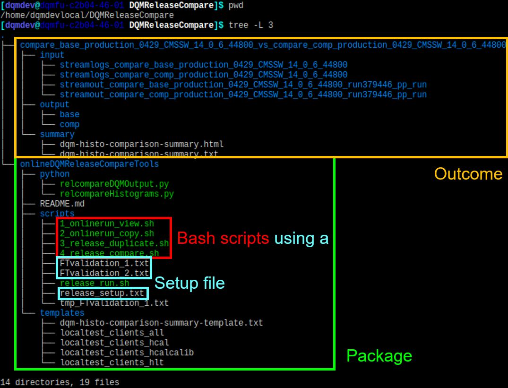

# DQM Online bin-by-bin comparison

## Overview

This repository contains tools for running a detailed comparison between the results of DQM clients (which are what is running at Point 5, producing histograms) of different CMSSW versions. The results are:

- An HTML document, listing all the comparisons made, and the number of differences found in the results.
- Links to DQMGUI, to display those results (WIP).

Based on the work of Andrius Kirilovas, Marcel Schneider, Praveen Chandra Tiwari and Zhengchen Liang.

## Results

### Directory structure

## Requirements

- Python >= 3.6
- ROOT (which version??)
- CMSSW: Any version whose results you want to compare.